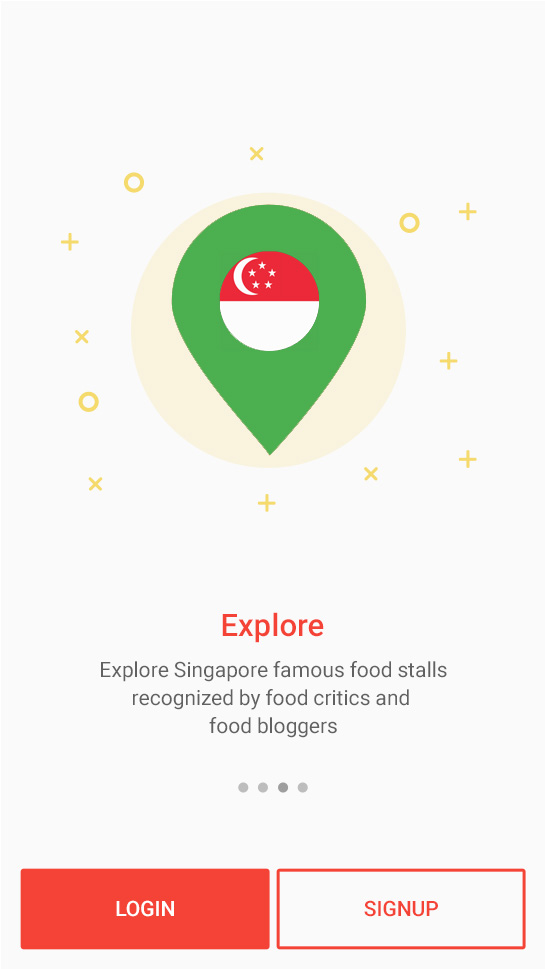
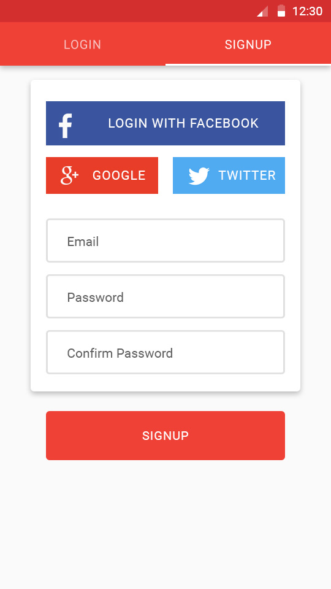
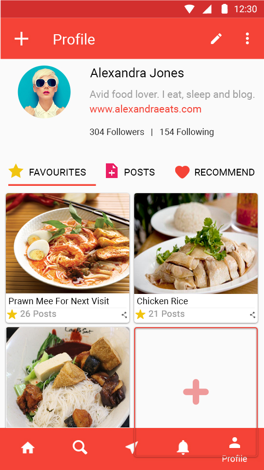
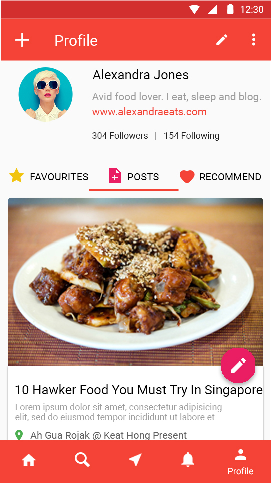
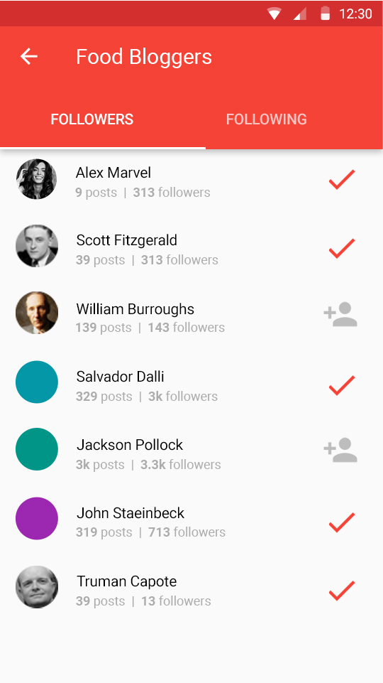

An android app, fully integrated for sharing food stall reviews, location and people details.

#### Features

- post about a food stall
- real-time nearby food stall updates
- Google maps integration, find optimal route to visit stall
- follow bloggers
- add location to a blog post
- quickly search across database of posts, bloggers

#### Screen-shots

#### Technical Features

- android app
- authentication using Firebase Auth using Google, Facebook, Twitter, Email
- real-time updates and changes using Firebase Relatime Database
- post and user images using Firebase Storage without sacrificing quality
- Google maps api for location updates 

*Private work (FO8E81C8E055)*