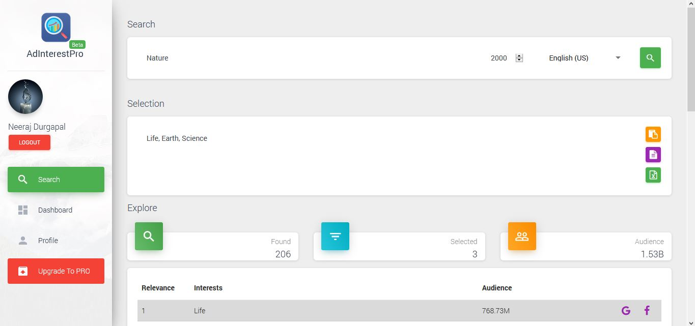

A full featured web-app for ad keywords research.

#### Features

- User accounts
- User dashboard
- Admin dashboard
- Stripe subscriptions
- Keywords research based on Audience count
- Usage statistics, charts, graphs
- Copy-paste, download selection on the fly

#### Tech

- Node
- Angular 7
- Firebase Firestore, Auth, Functions
- Facebook Marketing
- Stripe
- Mailchimp
- Heroku
- Gitlab CD

#### Screen-shots

*Private work*