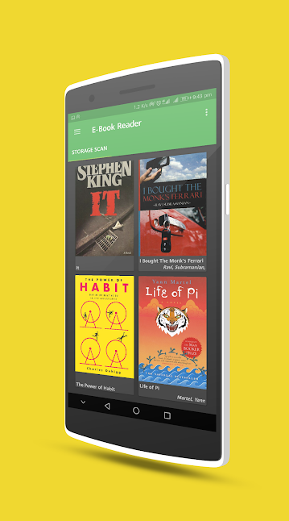
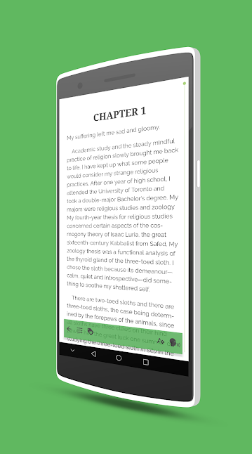
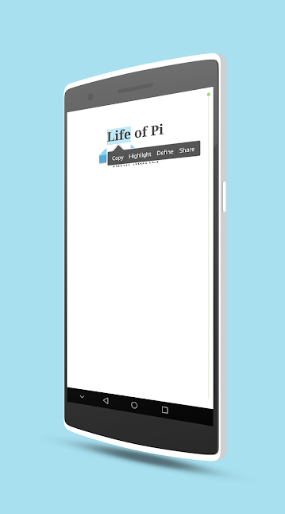
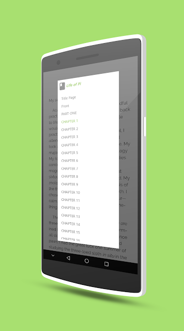

A simple e-book reader for epub files.
*[Google Play Store](https://play.google.com/store/apps/details?id=com.ilusons.ebr)*

#### Features

- Supports .epub files with valid metadata.
- Auto library management with scan and collections.
- All basic tools like highlight, TTS, etc in reader mode.

#### Screen-shots

