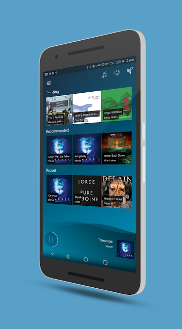
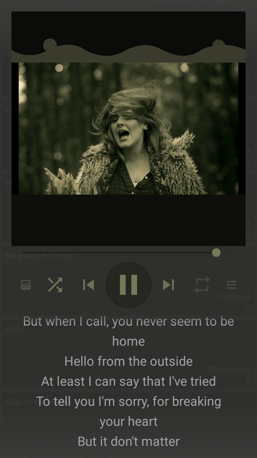
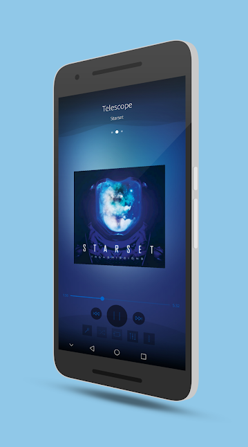
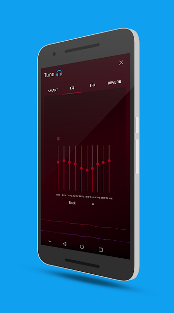
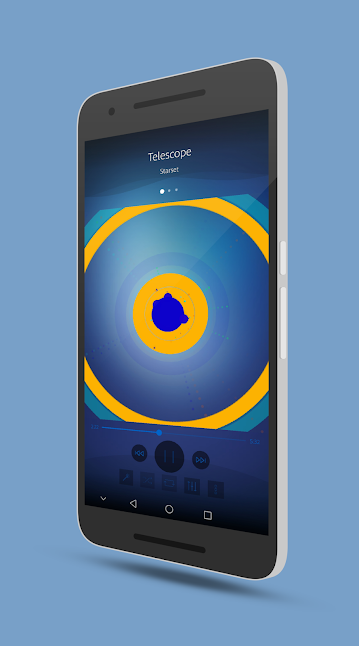
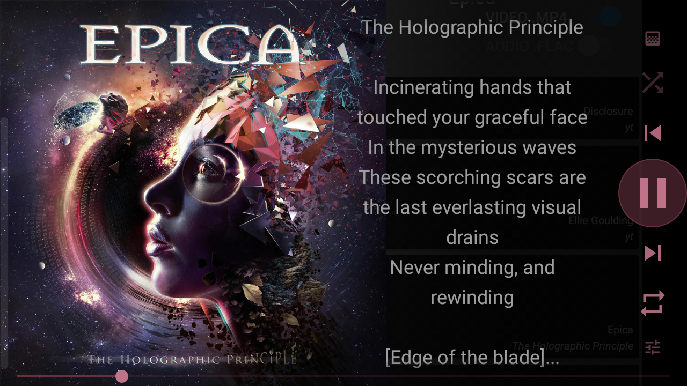

A unique, non-conventional music player for Android with personalized recommendations and unlimited music!
*[Google Play Store](https://play.google.com/store/apps/details?id=com.ilusons.harmony)*

#### Features

##### Library
- Android playlist support, basic management
- Auto library management
- Audio 🎵
- Video 🎦

##### SFX
- Equalizer 5-10 bands
- Bassboost
- Loudness
- Virtualization
- Reverb

##### Playback
- Android / OpenSL based player
- Auto playback
- Visualization
- Video playback support (landscape mode for better view)
- Notification support
- Lock-screen support
- Headset/Media buttons support (auto pause/resume)

##### UI
- Cover-art (metadata, online)
- Lyrics (timestamped, scrolling) (metadata, online)
- Adaptive player UI based on cover-art

#### Screen-shots

*[Website](http://harmony.ilusons.com)*