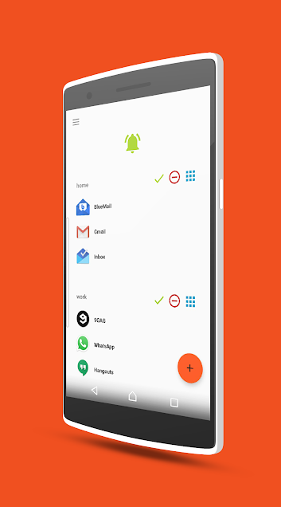
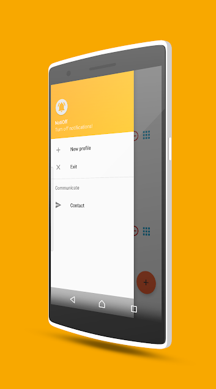
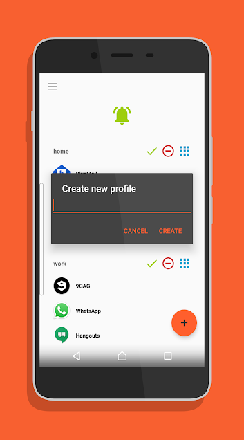
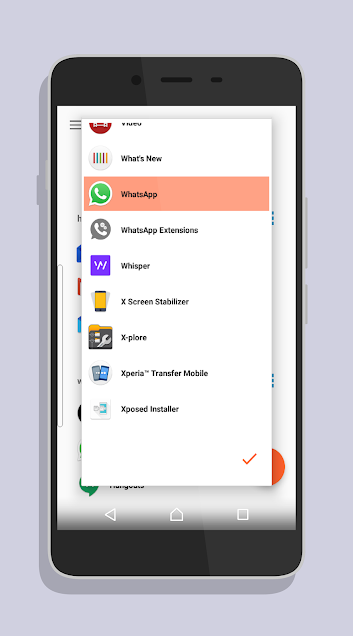

A simple tool to get rid of notifications.
*[Google Play Store](https://play.google.com/store/apps/details?id=com.ilusons.notioff)*

#### Features

- Profiles to turn off notifications from selected apps
- Activate a profile to turn off notifications
- Globally turn off all notifications
- Beautiful and simple user interface
- Safe, and secure (no extra permissions needed)

#### Screen-shots

